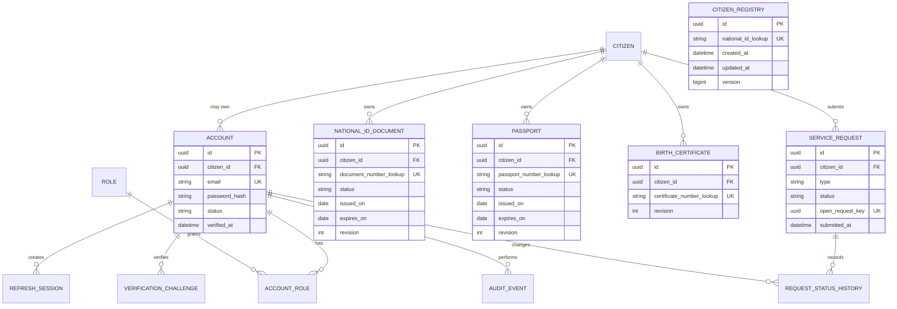

# Target domain and data model

## Purpose

This is the refactored target model. It intentionally leaves the legacy tables created by `V1__baseline_schema.sql` intact while the new model is backfilled and validated. Legacy paths remain disabled until that migration is reviewed.

## Bounded contexts

| Context | Responsibility | Does not own |
|---|---|---|
| Citizen | The verified person and their stable public identifier | Login credentials and document history |
| Account | Authentication, roles, refresh sessions, and verification challenges | Citizen demographics |
| Document | National identity, passport, and birth-certificate records | Account passwords or roles |
| Service request | Citizen-initiated issuance, renewal, correction, and replacement workflows | The document source of truth |
| Audit | Immutable security and personal-data access events | Business decisions |

## Entity relationship model

## Data rules

- All API-facing identifiers are UUIDs. Auto-increment legacy IDs never leave the API.
- `Citizen` is the one owner of identity, persisted in `citizen_registry`. Documents and accounts reference it by a foreign key; they never join through a national-ID string.
- A citizen can have one citizen account and may have many historical document revisions. Employee and admin accounts have no `citizen_id`.
- Credential material is limited to a password hash and a hashed refresh token. Raw passwords and raw refresh tokens are never stored.
- Lookup values for national IDs and document numbers will be deterministic HMAC values, not plain text. The original values and high-risk personal fields require application-level encryption backed by an external key manager before production.
- Every mutable aggregate has `created_at`, `updated_at`, `created_by`, `updated_by`, and optimistic-lock `version` fields where appropriate.
- Documents are immutable once issued. Renewal or correction creates a new revision and preserves the prior revision.
- A service request uses an explicit state machine: `DRAFT`, `SUBMITTED`, `UNDER_REVIEW`, `APPROVED`, `REJECTED`, `COMPLETED`, `CANCELLED`.
- The implemented passport-request workflow currently supports `SUBMITTED`, `UNDER_REVIEW`, `APPROVED`, and `REJECTED`. The `open_request_key` unique value permits only one open passport request per citizen and is cleared when a request reaches a final status.
- `audit_events` are append-only and record actor, action, target type/ID, correlation ID, timestamp, result, and a minimized metadata payload. They never store passwords, tokens, or complete document contents.

## Roles and access model

| Role | Access |
|---|---|
| `CITIZEN` | Their own profile, documents, and service requests only |
| `EMPLOYEE` | Assigned or explicitly authorized requests; no unrestricted bulk export |
| `ADMIN` | Role and operational administration; personal-data access remains audited |

## Migration strategy

1. Back up the MySQL database and record its schema/data counts.
2. Add the new tables in a versioned Flyway migration; do not remove legacy tables.
3. Backfill each citizen/document relationship with an idempotent migration job.
4. Produce an integrity report for unmatched IDs, duplicates, invalid dates, and missing required document fields.
5. Switch the new API use cases to the new tables while keeping legacy read endpoints disabled or behind an internal compatibility adapter.
6. Reconcile counts and sample records, then archive the legacy tables in a separately approved migration.

No destructive migration is permitted until steps 1-5 are complete and reviewed.
